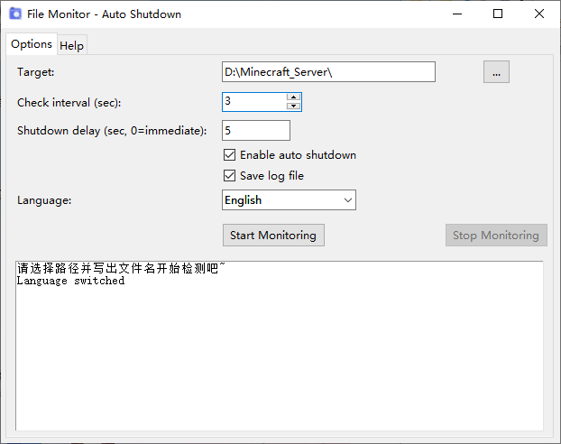

# FileMonitor - File Monitoring & Auto Shutdown Tool

[中文简体](README_zh_CN.md) | [中文繁體](README_zh_TW.md)

Monitors the appearance of a specified file or folder, automatically logs the event, and optionally shuts down the system. Perfect for detecting completed downloads (e.g., large files via SFTP) and turning off the PC afterward.

## Features
- Supports file and folder monitoring
- Adjustable check interval and shutdown delay
- Auto-detection of system language (Chinese / English / Traditional Chinese)
- Optional log file generation
- Countdown timer with the ability to cancel shutdown
- Resizable window

## How to Run
1. Run the packaged `FileMonitor.exe` directly (no Python required).
2. Or execute `FileMonitor.py` with Python 3 (tkinter is required but included with standard Python installations).

## License
[MIT License](LICENSE)