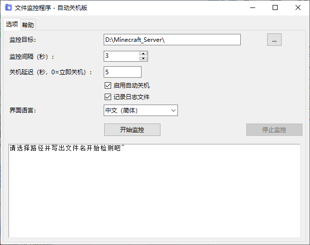

# FileMonitor - 文件监控自动关机工具

[English](README.md) | [中文繁體](README_zh_TW.md)

监视指定文件或文件夹是否出现，可自动记录日志并在检测到后执行关机。适用于大型文件下载检测（例如通过 SFTP 下载的文件），完成后自动关闭电脑。

## 功能
- 支持文件/文件夹监控
- 自定义检查间隔与关机延迟
- 自动检测系统语言（中文 / English / 繁體中文）
- 日志记录开关
- 关机倒计时可取消
- 窗口自由缩放

## 运行方式
1. 直接运行打包好的 `FileMonitor.exe`（无需 Python 环境）。
2. 或用 Python 3 执行 `FileMonitor.py`（需 tkinter 库，标准 Python 已自带）。

## 授权协议
[MIT License](LICENSE)