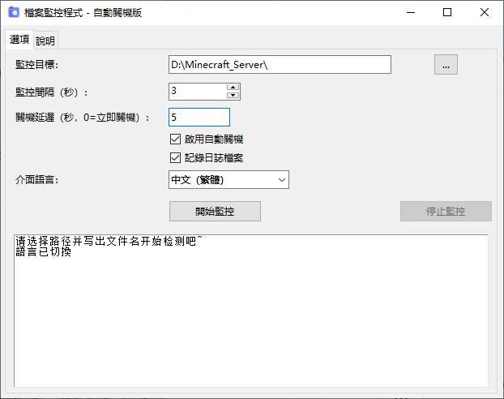

# FileMonitor - 檔案監控自動關機工具

[English](README.md) | [中文简体](README_zh_CN.md)

監視指定的檔案或資料夾是否出現，可自動記錄日誌並在偵測到後執行關機。適合用於大型檔案下載偵測（例如透過 SFTP 下載的檔案），完成後自動關閉電腦。

## 功能
- 支援檔案/資料夾監控
- 自訂檢查間隔與關機延遲
- 自動偵測系統語言（中文 / English / 繁體中文）
- 日誌記錄開關
- 關機倒數計時可取消
- 視窗可自由縮放

## 執行方式
1. 直接執行已打包的 `FileMonitor.exe`（不需安裝 Python 環境）。
2. 或使用 Python 3 執行 `FileMonitor.py`（需 tkinter 函式庫，標準 Python 已內建）。

## 授權條款
[MIT License](LICENSE)